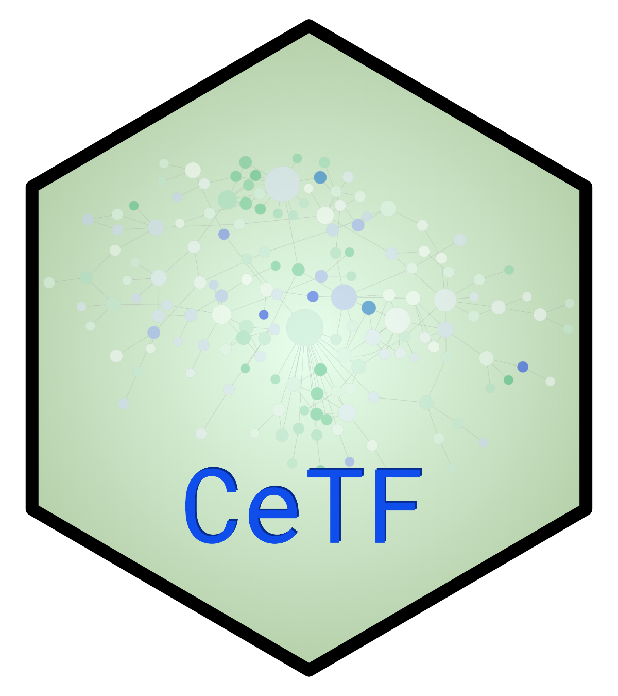

# CeTF 
An implementation of PCIT and RIF analysis in R

## Overview
This package provides the necessary instructions for performing the Partial Correlation coefficient with Information Theory (PCIT) from [Reverter and Chan 2008](https://doi.org/10.1093/bioinformatics/btn482) and Regulatory Impact Factors (RIF) from [Reverter et al. 2010](https://doi.org/10.1093/bioinformatics/btq051) algorithm. The PCIT algorithm identifies meaningful correlations to define edges in a weighted network. The algorithm can be applied to any correlation-based network including but not limited to gene co-expression networks. While the RIF algorithm identify critical transcript factors (TF) from gene expression data. These two algorithms when combined provide a very relevant layer of information for gene expression studies (Microarray, RNA-seq and single-cell RNA-seq data).

## Installation
To properly run <b>ceTF</b> package is necessary to install some dependencies. For Linux users is necessary to install the following dependencies:
* libcurl4-openssl-dev
* libxml2-dev 
* libssl-dev
* gfortran
* build-essential
* libz-dev 
* zlib1g-dev
* libpng-dev
* libfontconfig1-dev
* libcairo2-dev

To install CeTF package:
```R
BiocManager::install("CeTF")
```
or
```R
devtools::install_github("cbiagii/CeTF")
```

To install the remaining dependencies:
```R
#Bioconductor dependencies
packagesBioc <- c('snpStats', 'airway', 'ComplexHeatmap', 'org.Hs.eg.db', 'RCy3')
BiocManager::install(packagesBioc[!packagesBioc %in% installed.packages()[,1]])

#CRAN dependencies
packagesCRAN <- c('circlize', 'GenomicTools', 'WebGestaltR')
install.packages(packagesCRAN[!packagesCRAN %in% installed.packages()[,1]])
```

## Docker
To install docker follow the instructions in the links below depending on your operating system
* CentOS: https://docs.docker.com/install/linux/docker-ce/centos/
* Debian: https://docs.docker.com/install/linux/docker-ce/debian/
* Fedora: https://docs.docker.com/install/linux/docker-ce/fedora/
* Ubuntu: https://docs.docker.com/install/linux/docker-ce/ubuntu/
* MacOS: https://docs.docker.com/docker-for-mac/install/
* Windows: https://docs.docker.com/docker-for-windows/install/

#### Docker pull
Once docker is installed, the next step is pull the **CeTF** image from dockerhub (https://hub.docker.com/r/biagii/cetf) using the following command:
```docker
docker pull biagii/cetf
```

#### Running image
There are several differents parameters to run the downloaded image. The most commom way is executing the following command:
```docker
docker run --rm -d -p PORT:PORT -e PASSWORD=password --name [ANY_NAME] -v /server/path/:/docker/path/ -e USERID=$UID biagii/cetf
```
Once the docker image is running, the Rstudio interface with all the necessary dependencies will be made available, and of course the CeTF package, installed ready for use.

## Tutorials
In this section we have some tutorials available to help the user adapt their own data to run the CeTF package 
- [Vignette](./docs/vignette.html);
- [TCGA-STAD example](./docs/TCGA-STAD.html).


## Help
<p>Any questions contact the developer by email: <a href="#">cbiagijr@gmail.com</a></p>
